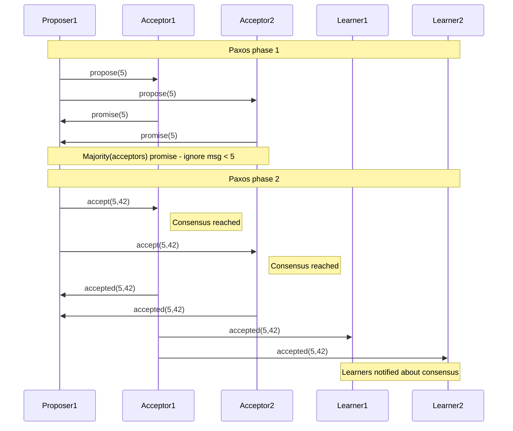

erl_distrib_systems
=====

Notes on distributed systems in Erlang

Build
```sh
rebar3 compile
```

## Paxos

```shell
rebar shell
```
```erlang
paxos:start().
```

Papers:
* [The Part-Time Parliament](https://lamport.azurewebsites.net/pubs/pubs.html#lamport-paxos) by Leslie Lamport
* [Paxos Made Simple](https://lamport.azurewebsites.net/pubs/pubs.html#paxos-simple) by Leslie Lamport


